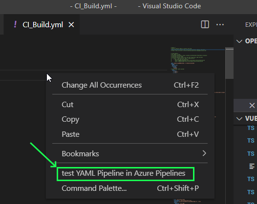
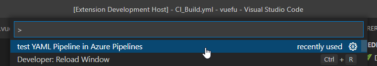
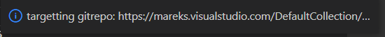
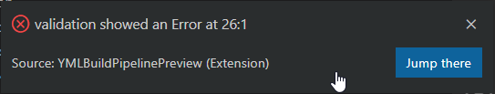

# Yaml BuildPipeLine Preview README

Yaml BuildPipeLine Preview is a small extension to check the syntax and "runabilitly" for a pipeline.

## Features

It adds a ability to test your current yaml - pipeline file with the preview api from azure devops to check the syntax of your file - **without need to check it in or run a real build/release**

It uses a feature mentioned in the forum here: [DeveloperCommunity - Ability to test yaml builds locally](https://developercommunity.visualstudio.com/t/ability-to-test-yaml-builds-locally/366517)

## Requirements

You need a azure devOps project and a created pipeline in the specific project you want to run it in.
Additionally the extension needs an [Personal Access Token](https://docs.microsoft.com/en-us/azure/devops/organizations/accounts/use-personal-access-tokens-to-authenticate?view=azure-devops) to invoke the Azure DevOps Pipelines API.

Pls refer to the [Azure DevOps Documentation](https://docs.microsoft.com/en-us/azure/devops/organizations/accounts/use-personal-access-tokens-to-authenticate?view=azure-devops) to create one in your organisation

## How to use

You just need to open up the yml file and select the command in the context menu or the commandlist

context menu:

or here from the list:

Then the extension tries to obtain the information needed to invoke the devops api.

### 1) Start of the process
The extension validates the current Situation.

following errors can occur:

* `no file editor opened - pls open the yaml file!`: well should be self explaining...
* `thats no yml file!!! please open the yaml-pipeline file!`: well should be self explaining...

### 2) Identification of the devOps Project
The extension tries to identify the Azure Devops orgaisation and project.
If the setting do not have the property `ymlbuildpipelinepreview.azureDevOpsUrl` is not set, the extension looks if the code is hosted in the Azure DevOps Git repo - if yes the remote url is used to identify it.

If the remote url is found - you see that message:

If this is not possible the extension asks you  with an input box `Url of the Azure DevOps tenant you are using including the path to the Project. (e.g. https://dev.azure.com/{Organisation}/{Project} or https://{Organisation}.visualstudio.com/DefaultCollection/{Project})`. Please hand over the url and we can proceed...

If the Url is not provided or not parseable - you get the message:
`😕 please provide an Azure DevOpsUrl to connect to it! aborting..`

### 3) getting/ reading the Personal Access Token

if the token is not found in the .vscode/settings.json file (property: `ymlbuildpipelinepreview.devOpsApiPAT`)
You will get asked: 
  `Please enter Personal Access Token for the DevOpsAPI in ${organisation} -> ${project}`
Please hand over the url and we can proceed...

if you do not enter a value you will get the message `no PAT no build 😥 - aborting...`

### 4) getting/reading the pipelineID to use

if the token is not found in the .vscode/settings.json file (property: `ymlbuildpipelinepreview.pipelineID`)
You will get asked:
  `Please enter a valid PipelineID`
Please hand over the url and we can proceed...

if you do not enter a value you will get the message `no Pipeline ID no build 😥 - aborting...`

### 5) doing the magic stuff

next the extension tries to get the yml content from the editor and send it to the Azure DevOps Pipelines API.

if the response indicates success - the simulation was successful - you get the message

* 

if not you will get for example the following message:

* 

in this example the error is at Line 26 - position 1 - with clicking the button "Jump there" the cursor gets set to the specific position.

## Extension Settings

Include if your extension adds any VS Code settings through the `contributes.configuration` extension point.

For example:

This extension contributes the following settings:

* `ymlbuildpipelinepreview.devOpsApiPAT`: Personal Access Token for invoking the API
* `ymlbuildpipelinepreview.pipelineID`: Pipeline ID to be used for simulating the pipeline run
* `ymlbuildpipelinepreview.azureDevOpsUrl`: devOps Url where your project and pipelines are hosted.
   if hosted in an azure devops git repo the extension tries to identifiy it from there.

if the settings are not set you get asked on the first run of the extension in your project.

## Known Issues

none so far but you are in the early stage of development 😅.

## Release Notes

Users appreciate release notes as you update your extension.

### 1.0.0

Initial release of it :P
### -> 1.0.4

Bundle updates and readme fixes...

### 1.0.5

Fix parsing DevOpsUrl...

### 1.0.6

Fix in menu definition...

## License

it is published under MIT License.
